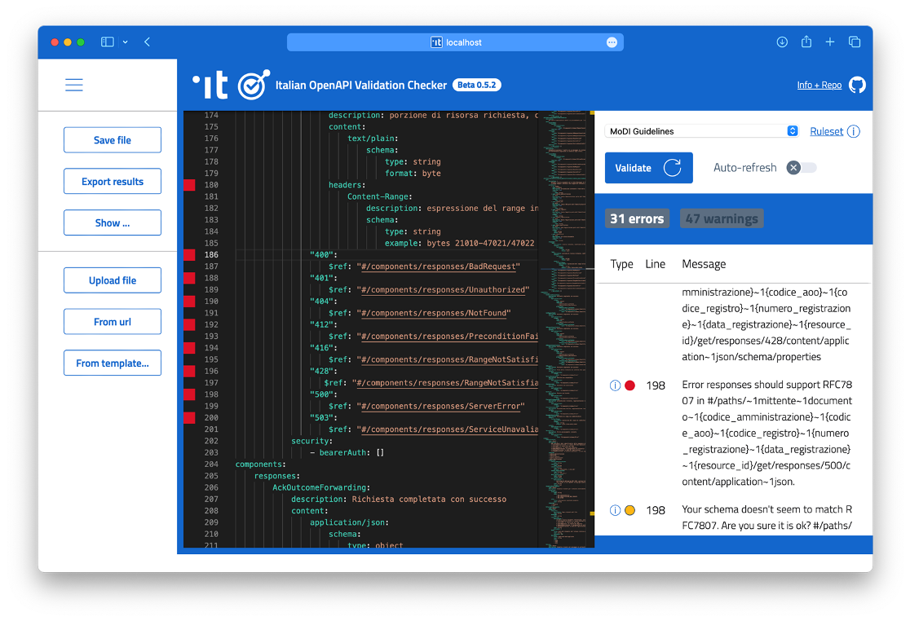
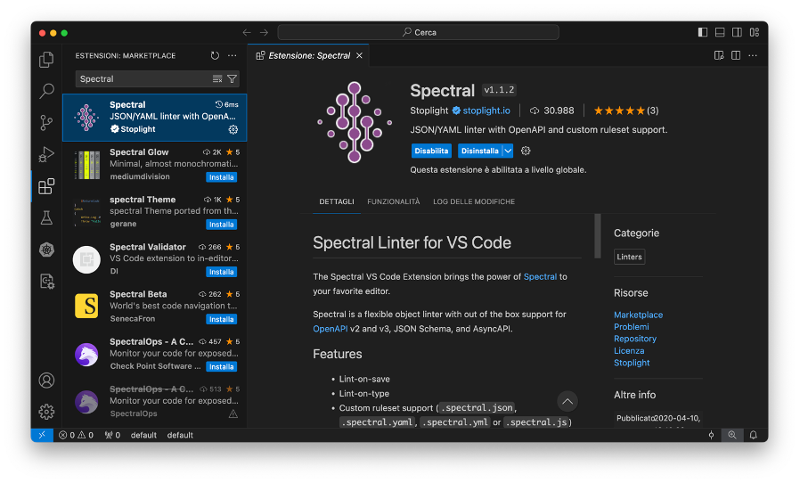
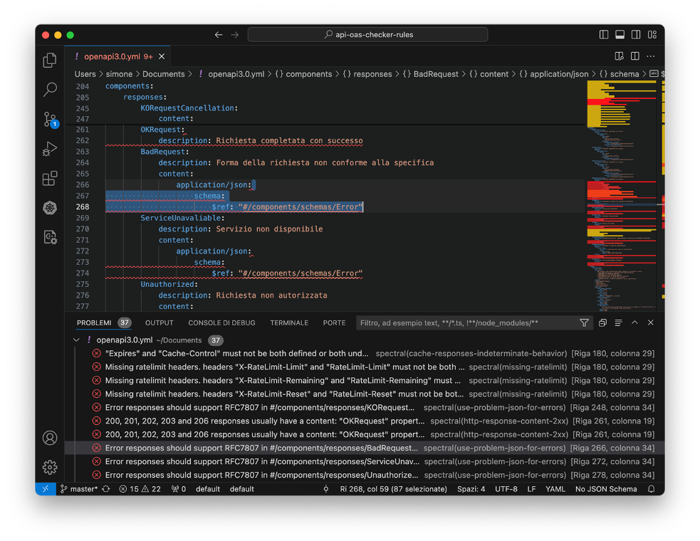
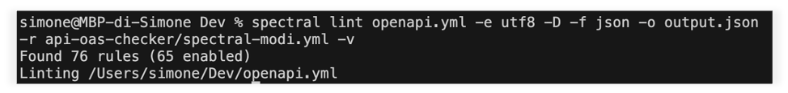

# Guida alla Validazione delle OpenAPI per l'Interoperabilità Tecnica della PA Italiana

## Obiettivo della Guida

Questa guida ha l'obiettivo di fornire le istruzioni necessarie per validare le interfacce OpenAPI affinché aderiscano alle regole del Modello di Interoperabilità Tecnica per la Pubblica Amministrazione (PA) Italiana.

Per maggiori informazioni sul modello, è possibile scaricare il documento [qui](https://www.agid.gov.it/sites/agid/files/2024-05/linee_guida_interoperabilit_tecnica_pa.pdf) e aprirlo con Adobe Reader per visualizzare gli allegati. L’allegato con le regole è intitolato **Raccomandazioni di implementazione**.

## Metodi di Validazione

### Primo Metodo: il Sito Web

#### Italian OpenAPI Validation Checker

[**Italian OpenAPI Validation Checker**](https://italia.github.io/api-oas-checker/) è una web app che permette di validare le interfacce OpenAPI direttamente da browser, identificando tutti gli errori presenti.

Per eseguire la validazione, è sufficiente:
1. Inserire il contenuto di un’interfaccia OpenAPI.
2. Cliccare su **Validate**.



#### Importante

- Utilizzare il set di regole **ModI Guidelines**.
- Correggere obbligatoriamente gli errori segnalati in rosso.
- Correggere opzionalmente i warning segnalati in arancione.
- In grigio sono presenti suggerimenti utili, anche questi opzionali.

### Secondo Metodo: l'estensione per IDE

#### L'estensione

Spectral, lo strumento alla base del sito web, è disponibile anche come estensione per **Visual Studio Code** e altri IDE.

> **Che cos'è Spectral?**
> 
> Spectral è uno strumento di linting open-source progettato per la validazione, la formattazione e la pulizia dei file JSON e YAML. È particolarmente utile per la verifica delle specifiche OpenAPI, garantendo che aderiscono agli standard e alle best practices definite.
> 
> Per ulteriori informazioni, visita il sito ufficiale di [Spectral](https://stoplight.io/open-source/spectral/).

#### Installazione

È possibile scaricare l’estensione dallo store integrato nel proprio IDE di riferimento, ad esempio Visual Studio Code. L’estensione per quest'ultimo è scaricabile [qui](https://marketplace.visualstudio.com/items?itemName=stoplight.spectral).



#### Configurazione

Dalle impostazioni dell’estensione nell’IDE, è necessario configurare il file delle regole. Si può scegliere tra due opzioni:
1. Avere il file delle regole localmente sul proprio computer e inserire il relativo percorso.
2. Inserire l’URL remoto (es. GitHub) al file delle regole.

Per i file su GitHub, è possibile far riferimento al [repository ufficiale](https://github.com/italia/api-oas-checker-rules/releases) delle regole.


#### Funzionamento

L’estensione segnala in tempo reale gli errori e i warning rilevati nei file OpenAPI aperto (file .yaml, .yml o .json).



### Terzo Metodo: daL Linea di Comando (CLI)

#### Linea di Comando (CLI)

Spectral è utilizzabile anche da linea di comando (CLI) per fare validazione massiva delle OpenAPI.

Su GitHub, a [questo link](https://github.com/stoplightio/spectral), è disponibile una guida per l’installazione di Spectral in locale, tramite npm (maggiori info [qui](https://www.npmjs.com/)) e yarn (maggiori info [qui](https://yarnpkg.com/)).


Per validare un file OpenAPI, utilizzare il seguente comando da terminale:

```sh
spectral lint percorso_file_openapi –e utf8 –D –f json –o percorso_file_output –r percorso_file_regole -v
```



#### Parametri del Comando

- `percorso_file_openapi`: il percorso al file contenente l’interfaccia OpenAPI da validare;
- `percorso_file_output`: il percorso al file JSON di output che conterrà tutti gli errori individuati;
- `percorso_file_regole`: il percorso al file delle regole per la validazione, anche remoto.

#### Tip

Togliendo il parametro `–D`, il tool restituirà in output anche i warning e i consigli per essere ancor più compliant alle best-practice per l’interoperabilità e allo standard OpenAPI 3.

Nel file di output, in formato JSON, è presente la lista di tutte le occorrenze in cui le regole sono state violate.


Speriamo che questa guida sia utile per garantire che le vostre interfacce OpenAPI rispettino gli standard richiesti per l'interoperabilità tecnica nella Pubblica Amministrazione Italiana. Buona validazione!